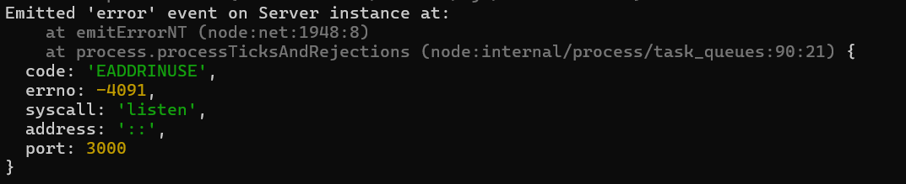
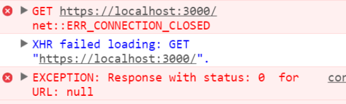

# Manejo de Excepciones en Node.js

**Nombre completo:** Melany Rosmery Moreira Zambrano  
**Carrera / Curso:** Ingeniería en Tecnologías de la Información / Aplicaciones Distribuidas  
**Fecha de entrega:** 27 de Junio del 2025

---

## Introducción

El manejo de excepciones es una parte fundamental en el desarrollo backend, ya que permite controlar y responder adecuadamente ante situaciones inesperadas o errores durante la ejecución de una aplicación. Un manejo adecuado de errores mejora la calidad, seguridad y mantenibilidad del código, permitiendo que los sistemas sean más robustos y confiables.

---

## Tipos de Errores en Node.js

En Node.js, los errores pueden clasificarse en:

- **Errores de sintaxis (SyntaxError):**  
  Ocurren cuando el código fuente contiene errores de escritura o estructura.
- **Errores en tiempo de ejecución (TypeError, ReferenceError):**  
  - *TypeError:* Se produce al realizar operaciones sobre tipos de datos incorrectos.
  - *ReferenceError:* Se produce al referenciar variables no definidas.
- **Errores del sistema (SystemError):**  
  Relacionados con operaciones del sistema operativo, como acceso a archivos o red.
- **Errores personalizados (CustomError):**  
  Definidos por el desarrollador para controlar situaciones específicas de la aplicación.

---

## Buenas Prácticas para el Manejo de Excepciones

- **Uso correcto de bloques try-catch:**  
  Permite capturar errores en bloques de código sin detener la aplicación.
- **Manejo de errores asincrónicos:**  
  Utilizar `try-catch` en funciones `async/await` y `.catch()` en Promesas para capturar errores en operaciones asíncronas.
- **Centralización del manejo de errores:**  
  Implementar middlewares de errores en Express para gestionar todos los errores en un solo lugar.
- **Logging de errores:**  
  Registrar los errores usando herramientas como `console.error` o librerías como `winston` para facilitar el monitoreo y la depuración.
- **Respuestas HTTP claras y estándar:**  
  Responder con códigos y mensajes adecuados (500, 400, 404, etc.) para que el cliente pueda interpretar y manejar los errores correctamente.

---

## Ejemplo Aplicado a Proyectos de la Unidad 1

### Ejemplo: Chat con Socket.IO

En el proyecto "Chat en tiempo real con Socket.IO", se implementaron las siguientes estrategias de manejo de errores:

#### Uso de `try-catch` en funciones asíncronas

```javascript
// [index.js](http://_vscodecontentref_/0)
router.get("/", isLoggedIn, async (req, res, next) => {
  try {
    res.sendFile(views + "/index.html");
  } catch (error) {
    next(error); // Pasa el error al middleware de manejo de errores
  }
});
```

#### Middleware de manejo de errores con Winston

```javascript
// [errorHandler.js](http://_vscodecontentref_/1)
const winston = require("winston");

const logger = winston.createLogger({
  transports: [
    new winston.transports.Console(),
    // Se pueden agregar más transportes, como archivos
  ],
});

function errorHandler(err, req, res, next) {
  logger.error(err.stack);

  res.status(err.status || 500).json({
    success: false,
    message: err.message || "Error interno del servidor",
  });
}

module.exports = errorHandler;
```

#### Uso del middleware de errores en la aplicación

```javascript
const errorHandler = require("./middlewares/errorHandler");
app.use(errorHandler); // Middleware de errores al final de todas las rutas
```

---

## Reutilización del Código

**Identificación de funciones/módulos:**  
Se identificaron rutas y controladores donde era necesario implementar manejo de errores, especialmente en operaciones asíncronas y eventos de Socket.IO.

**Estrategia de refactorización:**  
Se envolvieron las funciones asíncronas en bloques `try-catch` y se centralizó el manejo de errores usando un middleware global en Express.

**Ventajas:**  
- Facilita el mantenimiento y la escalabilidad del código.
- Permite una respuesta uniforme ante errores.
- Mejora la trazabilidad y el monitoreo de fallos mediante logs.

---

## Implementación de Middleware de Errores

Se creó un middleware global en Express (`errorHandler.js`) que captura cualquier error no controlado en las rutas o controladores y responde con un mensaje y código de estado adecuado. Además, se utiliza la librería `winston` para registrar los errores en la consola.

---

## Evidencia de Funcionamiento

A continuación se muestran capturas de pantalla que verifican el correcto manejo de errores en el proyecto:

- **Error mostrado en consola del servidor:**  
  Captura de la consola donde Winston registra un error ocurrido en una ruta o evento.  
  

- **Respuesta de error en Postman o navegador:**  
  Captura de la respuesta JSON estándar al provocar un error en una ruta protegida o inexistente.  
  

---

## Conclusiones

El manejo adecuado de excepciones es esencial para el desarrollo de aplicaciones robustas y seguras. Durante la implementación en el proyecto de chat, se evidenció la importancia de centralizar el manejo de errores y registrar los fallos para su posterior análisis.  
Las principales dificultades fueron adaptar el código existente para capturar todos los errores posibles y estructurar respuestas claras para el usuario.  
Como mejora futura, se podría implementar un sistema de notificaciones en tiempo real para alertar a los administradores sobre errores críticos.

---

## Referencias

- [Documentación oficial de Node.js](https://nodejs.org/en/docs)
- [Documentación de Express](https://expressjs.com/es/)
- [Socket.IO Documentation](https://socket.io/docs/)
- [Winston Logger](https://github.com/winstonjs/winston)
- [MDN Web Docs: Handling errors in Node.js](https://developer.mozilla.org/en-US/docs/Learn/Server-side/Express_Nodejs/Introduction#handling_errors)
