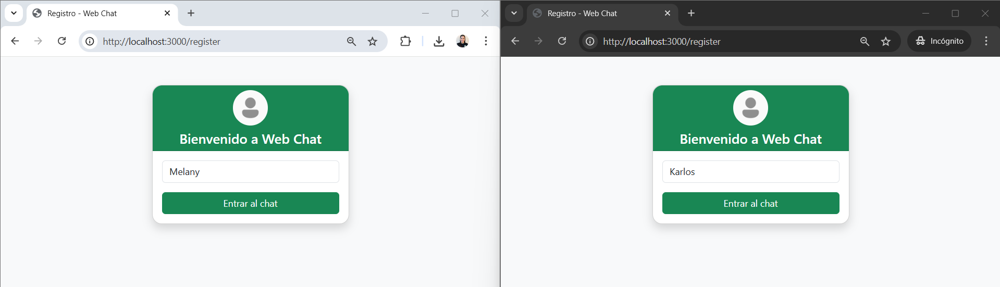
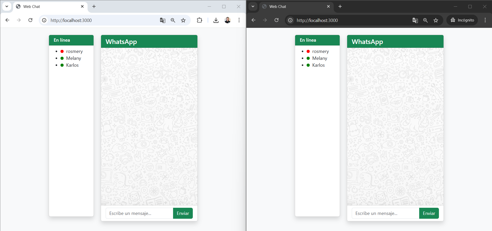
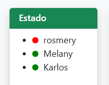
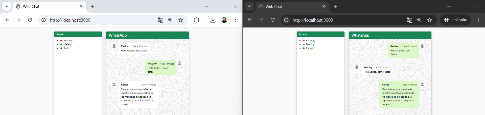
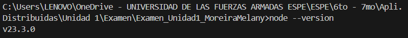
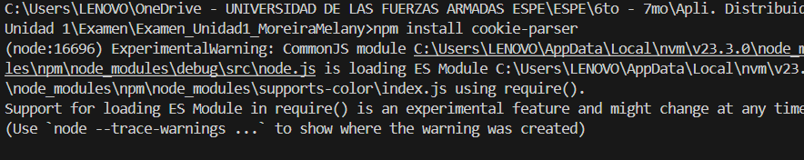
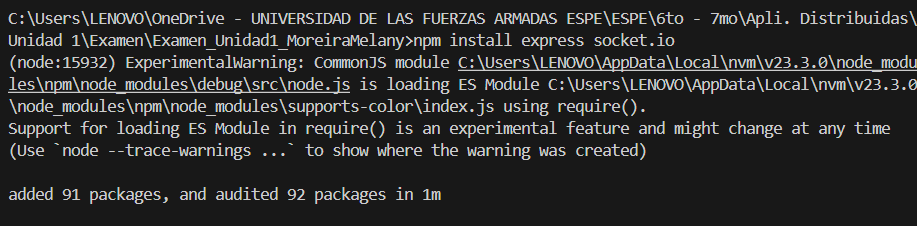
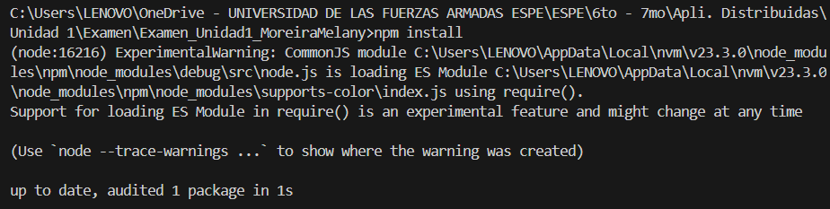
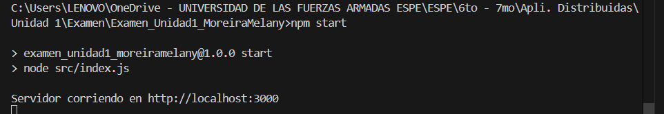

# Examen - Chat en Tiempo Real con Socket.IO

**Nombre completo:** Melany Rosmery Moreira Zambrano  
**Fecha de entrega:** 30 de mayo del 2025

---

## Introducción

Este exámen consiste en el desarrollo de un chat en tiempo real utilizando Node.js, Express y Socket.IO. El propósito es permitir la comunicación instantánea entre múltiples usuarios, simulando la experiencia de aplicaciones modernas en este caso simulamos el aplicativo/Chat de WhatsApp.  
El uso de sockets es fundamental en aplicaciones en tiempo real, ya que permite la transmisión bidireccional y eficiente de datos entre el servidor y los clientes, lo que es esencial para chats, juegos en línea y otras aplicaciones colaborativas.

---

## Requisitos del Proyecto

### Funcionalidades requeridas

- Comunicación en tiempo real entre múltiples usuarios.
- Mostrar la lista de usuarios conectados y desconectados (con iconos de estado).
- Mejorar el diseño del chat (estilo moderno tipo WhatsApp, responsivo).
- Formato de mensajes alineados de izquierda a derecha según el remitente.

### Herramientas y tecnologías utilizadas

- Node.js
- Express
- Socket.IO
- HTML/CSS (Bootstrap y CSS personalizado)

---

## Implementación del Proyecto

### Estructura del código

- **Backend:**  
  - Servidor Node.js con Express y Socket.IO para gestionar conexiones y mensajes.
  - Rutas para servir archivos estáticos y vistas.
  - Middleware para autenticación de usuarios.
- **Frontend:**  
  - HTML y Bootstrap para la estructura y el diseño responsivo.
  - CSS personalizado para simular la apariencia de WhatsApp.
  - JavaScript para gestionar la conexión con Socket.IO, el envío y la recepción de mensajes, y la actualización de la lista de usuarios.

### Funcionalidades implementadas

- Envío y recepción de mensajes en tiempo real.
- Visualización de usuarios conectados y desconectados con iconos de estado en la parte izquierda de nuestro chat (verde para conectado, rojo para desconectado).
- Mensajes alineados a la derecha si son propios y a la izquierda si son de otros usuarios en este caso el receptor.
- Fondo predeterminado de whatsapp en el área de chat.
- Interfaz responsiva y moderna.

### Capturas de pantalla
- **Registro De Usuario**
  _Captura donde se observa el registro de los usuarios._
    
- **Inicio del chat:**  
  _Captura donde se ve nuestro inicio del chat, vetana principal._
    
- **Lista de usuarios conectados:**  
  _Captura donde se ve la lista de usuarios con los iconos de estado._
  
- **Intercambio de mensajes:**  
  _Captura mostrando mensajes alineados a la izquierda y derecha según el usuario._
  
- **Vista responsiva:**  
  _Captura del chat en una pantalla móvil o ventana pequeña._
  

---

## Instrucciones de Ejecución

### Requisitos previos

- Tener instalado [Node.js](https://nodejs.org/).
    
- Tener instalado [npm](https://www.npmjs.com/).
- Instalar el paquete `cookie-parser` (usado para el manejo de cookies en Express):
    
  ```bash
  npm install cookie-parser
- Instalar express y socket.io
    
  ```bash
  npm install cookie-parser

### Pasos para ejecutar el proyecto

1. **Instalar dependencias:**
   ```bash
   npm install
   ```
   _Instalación de dependencias._
   

2. **Ejecutar el servidor:**
   ```bash
   npm start
   ```
   _Servidor está corriendo._
   

3. **Abrir el chat en el navegador:**
   - Ir a `http://localhost:3000`
   _Chat abierto en el navegador._
   

---

## Capturas de Pantalla

- Chat en funcionamiento con varios usuarios conectados.
    
- Lista de usuarios mostrando conectados y desconectados.
    
- Mensajes alineados correctamente.
    
- Vista en dispositivo móvil.
    

---

## Conclusiones

Durante el desarrollo de este proyecto aprendí a utilizar Socket.IO para la comunicación en tiempo real y a estructurar una aplicación web moderna y responsiva.  
Las principales dificultades fueron la gestión de los estados de los usuarios y la alineación de los mensajes, las cuales superé investigando documentación y probando diferentes enfoques de CSS y lógica en JavaScript.

---

## Referencias

- [Git Hub. Tarea 2](https://github.com/melanymoreira/WebChat-MelanyMoreira.git)